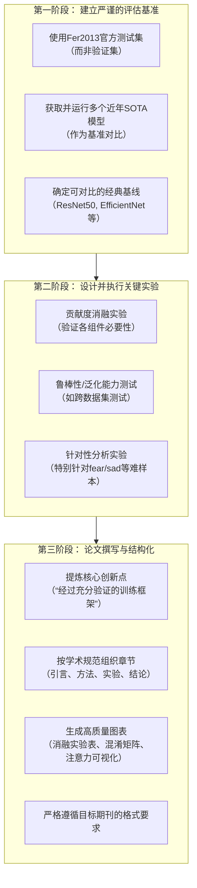

如果你决定基于现有代码基础并希望投稿核心期刊，那么核心任务不再是大幅修改模型，而是**将你现有的优秀工程实践转化为严谨的、有说服力的学术贡献**。

下图清晰地展示了从“工程实现”到“合格论文”的完整工作流程，你可以根据这个路线图来规划你的每一步行动：



下面我将详细说明每个阶段你需要完成的具体工作。

### 🔬 **第一阶段：建立严谨的评估基准（1-2周）**
这是**最核心、最基础**的一步。没有权威的评估，再好的结果也缺乏说服力。

1.  **获取Fer2013官方测试集**：
    *   你必须使用国际公认的**Fer2013官方测试集**（通常在Kaggle上提供）进行最终评估，而不是你自己划分的验证集。
    *   **行动**：找到官方的 `fer2013.csv` 文件，严格按官方划分，用你的最佳模型（`best_model_80_target.pth`）在 **`PrivateTest`** 集上测试，报告准确率。

2.  **复现近年SOTA模型作为对比**：
    *   仅仅说自己达到了73%是不够的。你必须证明你的**训练方法**让一个已知模型（ViT）达到了**超越或比肩近年先进方法的水平**。
    *   **行动**：选取 **3-5篇2020-2023年** 在Fer2013上表现优秀的论文（如使用EfficientNet、ResNet变体、注意力机制等的论文），**复现或引用**它们在官方测试集上的结果，与你的结果进行对比。这是证明你工作价值的直接证据。

### 📊 **第二阶段：设计并执行关键实验（2-3周）**
核心期刊审稿人极为看重实验的**完整性、严谨性和深入性**。

1.  **彻底的贡献度消融实验**：
    *   你需要定量证明你的每一个高级训练策略（动态权重调整、CutMix/MixUp、中等增强）都是有效的。
    *   **实验设计**：训练以下变体，在官方测试集上比较：
        *   **A. 完整模型**：你的所有策略。
        *   **B. 无动态权重**：使用固定类别权重。
        *   **C. 无混合增强**：只使用中等增强。
        *   **D. 基线模型**：标准ViT + 基础数据增强（随机裁剪翻转）。
    *   **呈现方式**：用表格清晰展示整体准确率，**尤其要列出`fear`和`sad`的准确率**，突出你的方法对难样本的提升。

2.  **鲁棒性与泛化能力分析**：
    *   **跨数据集测试**：将你训练好的模型，直接在另一个表情识别数据集（如CK+, JAFFE）上测试，观察其泛化能力。即使准确率下降，分析也很有价值。
    *   **噪声鲁棒性测试**：在测试图像中加入高斯噪声、模糊等，观察模型性能变化。这能体现你增强策略的有效性。

3.  **针对性分析实验（针对你的痛点）**：
    *   **混淆矩阵分析**：在官方测试集上生成详细的混淆矩阵，**精确量化**`fear`主要被误分为哪几类（如`sad`, `surprise`），并用文字分析原因。
    *   **失败案例分析**：找出一些被模型错误分类的`fear`和`sad`样本图像，作为论文附图，并尝试从光照、遮挡、头部姿态等方面进行分析。

### 📝 **第三阶段：论文撰写与结构化（1-2周）**
这是将你的工作“包装”成学术成果的关键。

1.  **重新定义和提炼你的创新点**：
    *   你的核心贡献**不是**“提出了一个新模型”，而是：**“我们提出并系统验证了一套针对Vision Transformer的高效表情识别训练框架。该框架通过动态类别权重、自适应混合增强等策略，显著提升了模型性能，特别是在传统难样本上，为ViT在FER任务中的应用提供了最佳实践方案。”**

2.  **严格按照学术论文结构组织**：
    *   **摘要**：用几句话精炼概括目的、方法、核心结果和结论。
    *   **引言**：讲好故事——交代FER的重要性、ViT的应用潜力、现有训练方法的不足、**你的工作如何填补空白**。
    *   **相关工作**：有条理地综述FER方法、ViT的应用、数据增强和类别不平衡处理技术，并**恰当地指出你工作与它们的区别和联系**。
    *   **方法**：清晰描述你的**整个训练框架**，而不仅仅是模型。将`DynamicWeightAdjuster`、`AdvancedAugmentation`等模块用公式和伪代码规范描述。
    *   **实验**：这是论文主体。分小节呈现：**数据集与评估指标、与SOTA方法的对比、消融实验、鲁棒性分析、失败案例讨论**。
    *   **结论与未来工作**：总结贡献，客观说明局限性，并指出改进方向。

3.  **图表与可视化**：
    *   **高质量图表**：消融实验的对比柱状图、混淆矩阵热力图、训练曲线图、注意力可视化图（如果能实现）等。
    *   **格式规范**：所有图表必须有清晰的标题、坐标轴标签、图例，并在正文中引用。

### 🎯 **投稿前的最后检查清单**

- [ ] **实验完整性**：所有关键实验（对比、消融、分析）均已完成，数据充分。
- [ ] **结果可靠性**：主要结果均在**官方测试集**上获得，且可复现。
- [ ] **创新点明确**：在引言和结论中，用1-2句话清晰概括你的核心贡献。
- [ ] **写作规范**：语言流畅，逻辑严密，无语法错误，图表专业。
- [ ] **格式合规**：严格遵循目标期刊（如《自动化学报》、《计算机辅助设计与图形学学报》等）的投稿模板要求。

**总结**：你目前拥有一个**非常扎实的工程基础**。要将其转化为一篇核心期刊论文，关键在于 **“转身”**——从追求更高准确率的“工程师”，转变为用严谨实验和清晰论述来证明一套方法有效性的“研究者”。这个过程需要投入大量时间在**补充实验和论文写作**上，而非继续调参。

如果你需要，我可以就 **“如何具体复现SOTA模型进行对比”** 或 **“如何将你的训练框架写成规范的方法论章节”** 提供更详细的建议。


我来为您写一个在PrivateTest集上测试最佳模型的测试类。这个类将加载您的训练模型，在测试集上进行评估，并生成详细的评估报告。

```python
import torch
import torch.nn as nn
import torch.nn.functional as F
from torch.utils.data import DataLoader
from torchvision import transforms, datasets
import timm
import numpy as np
from tqdm import tqdm
import os
from sklearn.metrics import classification_report, confusion_matrix, accuracy_score
import matplotlib.pyplot as plt
import seaborn as sns
import pandas as pd
import json
import warnings
warnings.filterwarnings('ignore')


class PrivateTestEvaluator:
    """在PrivateTest集上评估最佳模型的测试类"""
    
    def __init__(self, config=None):
        """初始化评估器"""
        # 设置设备
        self.device = torch.device('cuda' if torch.cuda.is_available() else 'cpu')
        print(f"使用设备: {self.device}")
        
        # 使用配置或创建默认配置
        if config is None:
            from dataclasses import dataclass
            @dataclass
            class TestConfig:
                model_name = 'vit_base_patch16_224'
                num_classes = 7
                img_size = 224
                batch_size = 16
                device = self.device
                class_weights = None
                drop_rate = 0.3
                
            self.config = TestConfig()
        else:
            self.config = config
            
        # 类别名称
        self.class_names = ['angry', 'disgust', 'fear', 'happy', 'neutral', 'sad', 'surprise']
        
        # 模型和转换
        self.model = None
        self.test_transform = None
        
        # 结果存储
        self.results = {}
        
    def create_model(self, model_path='./best_model_80_target.pth'):
        """创建和加载模型"""
        print(f"\n📦 创建模型: {self.config.model_name}")
        
        # 创建模型
        model = timm.create_model(
            self.config.model_name,
            pretrained=False,
            num_classes=self.config.num_classes,
            drop_rate=self.config.drop_rate
        ).to(self.device)
        
        # 加载训练的最佳模型
        if os.path.exists(model_path):
            print(f"📥 加载最佳模型: {model_path}")
            try:
                checkpoint = torch.load(model_path, map_location=self.device)
                
                # 处理不同的checkpoint格式
                if 'model_state_dict' in checkpoint:
                    state_dict = checkpoint['model_state_dict']
                elif 'state_dict' in checkpoint:
                    state_dict = checkpoint['state_dict']
                elif 'model' in checkpoint:
                    state_dict = checkpoint['model']
                else:
                    state_dict = checkpoint
                
                # 加载状态字典
                model.load_state_dict(state_dict)
                print("✅ 模型加载成功")
                
                # 如果有配置信息，更新配置
                if 'config' in checkpoint:
                    checkpoint_config = checkpoint['config']
                    print(f"📊 模型训练信息:")
                    print(f"  - 最佳准确率: {checkpoint.get('best_acc', 0)*100:.2f}%")
                    print(f"  - 训练轮数: {checkpoint.get('epoch', 0)+1}")
                
            except Exception as e:
                print(f"❌ 模型加载失败: {e}")
                # 尝试不同的加载方式
                try:
                    model.load_state_dict(checkpoint)
                    print("✅ 使用直接加载方式成功")
                except:
                    raise RuntimeError(f"无法加载模型权重: {e}")
        else:
            raise FileNotFoundError(f"模型文件不存在: {model_path}")
        
        self.model = model
        return model
    
    def get_test_transform(self):
        """获取测试数据转换"""
        if self.test_transform is None:
            self.test_transform = transforms.Compose([
                transforms.Resize((self.config.img_size, self.config.img_size)),
                transforms.Grayscale(num_output_channels=3),
                transforms.ToTensor(),
                transforms.Normalize(
                    mean=[0.485, 0.456, 0.406],
                    std=[0.229, 0.224, 0.225]
                )
            ])
        return self.test_transform
    
    def load_test_dataset(self, test_dir='./data/PrivateTest'):
        """加载测试数据集"""
        print(f"\n📁 加载测试数据集: {test_dir}")
        
        if not os.path.exists(test_dir):
            # 尝试不同的路径
            possible_paths = [
                './data/private',
                './data/private_test',
                './datasets/PrivateTest',
                '../data/PrivateTest'
            ]
            
            for path in possible_paths:
                if os.path.exists(path):
                    test_dir = path
                    print(f"✅ 找到测试集: {test_dir}")
                    break
            else:
                raise FileNotFoundError(f"找不到测试集，请检查路径。尝试过的路径: {possible_paths}")
        
        # 加载数据集
        test_dataset = datasets.ImageFolder(
            test_dir, 
            transform=self.get_test_transform()
        )
        
        # 验证类别数量
        if len(test_dataset.classes) != self.config.num_classes:
            print(f"⚠️  警告: 数据集类别数({len(test_dataset.classes)})与模型类别数({self.config.num_classes})不匹配")
            print(f"    数据集类别: {test_dataset.classes}")
        
        print(f"📊 测试集统计:")
        print(f"  - 总样本数: {len(test_dataset):,}")
        print(f"  - 类别: {test_dataset.classes}")
        
        # 显示每个类别的样本数
        class_counts = {}
        for _, label in test_dataset.samples:
            class_name = test_dataset.classes[label]
            class_counts[class_name] = class_counts.get(class_name, 0) + 1
        
        print(f"  - 各类别样本数:")
        for cls, count in class_counts.items():
            print(f"    {cls}: {count}")
        
        return test_dataset
    
    def evaluate(self, test_dir='./data/PrivateTest', model_path='./best_model_80_target.pth'):
        """在测试集上评估模型"""
        print("=" * 70)
        print("🧪 开始在PrivateTest集上进行模型评估")
        print("=" * 70)
        
        # 1. 创建并加载模型
        model = self.create_model(model_path)
        model.eval()
        
        # 2. 加载测试数据集
        test_dataset = self.load_test_dataset(test_dir)
        
        # 3. 创建数据加载器
        test_loader = DataLoader(
            test_dataset,
            batch_size=self.config.batch_size,
            shuffle=False,
            num_workers=4,
            pin_memory=True
        )
        
        # 4. 进行预测
        print(f"\n🔮 进行预测...")
        all_predictions = []
        all_labels = []
        all_probs = []
        all_images = []
        
        with torch.no_grad():
            for batch_idx, (images, labels) in enumerate(tqdm(test_loader, desc="预测")):
                images = images.to(self.device)
                
                # 前向传播
                outputs = model(images)
                probs = F.softmax(outputs, dim=1)
                _, predicted = torch.max(outputs, 1)
                
                # 保存结果
                all_predictions.extend(predicted.cpu().numpy())
                all_labels.extend(labels.numpy())
                all_probs.extend(probs.cpu().numpy())
                all_images.extend(images.cpu().numpy())
        
        # 5. 计算指标
        print(f"\n📊 计算评估指标...")
        
        # 总体准确率
        overall_accuracy = accuracy_score(all_labels, all_predictions)
        
        # 分类报告
        class_report = classification_report(
            all_labels, 
            all_predictions, 
            target_names=test_dataset.classes,
            digits=4,
            output_dict=True
        )
        
        # 混淆矩阵
        conf_matrix = confusion_matrix(all_labels, all_predictions)
        
        # 6. 保存结果
        self.results = {
            'overall_accuracy': overall_accuracy,
            'class_report': class_report,
            'confusion_matrix': conf_matrix.tolist(),
            'predictions': all_predictions,
            'labels': all_labels,
            'probabilities': all_probs,
            'class_names': test_dataset.classes,
            'total_samples': len(test_dataset)
        }
        
        return self.results
    
    def generate_report(self, save_dir='./results'):
        """生成详细的评估报告"""
        if not self.results:
            print("⚠️  请先运行evaluate()方法")
            return
        
        # 创建保存目录
        os.makedirs(save_dir, exist_ok=True)
        
        print(f"\n📄 生成评估报告...")
        
        # 1. 打印总体结果
        print("\n" + "=" * 70)
        print("🎯 评估结果总结")
        print("=" * 70)
        print(f"📊 总体准确率: {self.results['overall_accuracy']*100:.4f}%")
        print(f"📈 总样本数: {self.results['total_samples']:,}")
        print("-" * 70)
        
        # 2. 打印每个类别的详细结果
        print("📋 每个类别性能:")
        class_report = self.results['class_report']
        
        # 创建表格
        metrics_df = pd.DataFrame({
            'Precision': [class_report[cls]['precision'] * 100 for cls in self.results['class_names']],
            'Recall': [class_report[cls]['recall'] * 100 for cls in self.results['class_names']],
            'F1-Score': [class_report[cls]['f1-score'] * 100 for cls in self.results['class_names']],
            'Support': [class_report[cls]['support'] for cls in self.results['class_names']]
        }, index=self.results['class_names'])
        
        # 添加平均值行
        metrics_df.loc['Weighted Avg'] = [
            class_report['weighted avg']['precision'] * 100,
            class_report['weighted avg']['recall'] * 100,
            class_report['weighted avg']['f1-score'] * 100,
            class_report['weighted avg']['support']
        ]
        
        metrics_df.loc['Macro Avg'] = [
            class_report['macro avg']['precision'] * 100,
            class_report['macro avg']['recall'] * 100,
            class_report['macro avg']['f1-score'] * 100,
            class_report['macro avg']['support']
        ]
        
        # 格式化显示
        pd.set_option('display.float_format', '{:.4f}'.format)
        print(metrics_df.to_string())
        
        # 3. 保存详细结果到JSON
        report_path = os.path.join(save_dir, 'private_test_report.json')
        with open(report_path, 'w') as f:
            json.dump({
                'overall_accuracy': float(self.results['overall_accuracy']),
                'class_report': self.results['class_report'],
                'class_names': self.results['class_names'],
                'total_samples': self.results['total_samples'],
                'timestamp': pd.Timestamp.now().isoformat()
            }, f, indent=4)
        print(f"\n✅ 详细报告已保存: {report_path}")
        
        # 4. 保存预测结果到CSV
        predictions_df = pd.DataFrame({
            'true_label': [self.results['class_names'][l] for l in self.results['labels']],
            'predicted_label': [self.results['class_names'][p] for p in self.results['predictions']],
            'correct': [l == p for l, p in zip(self.results['labels'], self.results['predictions'])]
        })
        
        # 添加每个类别的概率
        for i, cls in enumerate(self.results['class_names']):
            predictions_df[f'prob_{cls}'] = [prob[i] for prob in self.results['probabilities']]
        
        predictions_path = os.path.join(save_dir, 'detailed_predictions.csv')
        predictions_df.to_csv(predictions_path, index=False)
        print(f"✅ 详细预测结果已保存: {predictions_path}")
        
        return metrics_df
    
    def plot_confusion_matrix(self, save_dir='./results', figsize=(12, 10)):
        """绘制并保存混淆矩阵"""
        if not self.results:
            print("⚠️  请先运行evaluate()方法")
            return
        
        os.makedirs(save_dir, exist_ok=True)
        
        print(f"\n🎨 绘制混淆矩阵...")
        
        # 创建混淆矩阵
        conf_matrix = np.array(self.results['confusion_matrix'])
        class_names = self.results['class_names']
        
        # 归一化混淆矩阵
        conf_matrix_norm = conf_matrix.astype('float') / conf_matrix.sum(axis=1)[:, np.newaxis]
        
        # 创建图形
        fig, (ax1, ax2) = plt.subplots(1, 2, figsize=figsize)
        
        # 原始混淆矩阵
        sns.heatmap(conf_matrix, annot=True, fmt='d', cmap='Blues',
                   xticklabels=class_names, yticklabels=class_names,
                   ax=ax1, cbar=False)
        ax1.set_xlabel('预测标签', fontsize=12)
        ax1.set_ylabel('真实标签', fontsize=12)
        ax1.set_title('混淆矩阵（原始计数）', fontsize=14, pad=20)
        
        # 归一化混淆矩阵
        sns.heatmap(conf_matrix_norm, annot=True, fmt='.3f', cmap='Oranges',
                   xticklabels=class_names, yticklabels=class_names,
                   ax=ax2, cbar=False)
        ax2.set_xlabel('预测标签', fontsize=12)
        ax2.set_ylabel('真实标签', fontsize=12)
        ax2.set_title('混淆矩阵（归一化）', fontsize=14, pad=20)
        
        plt.tight_layout()
        
        # 保存图像
        cm_path = os.path.join(save_dir, 'confusion_matrix.png')
        plt.savefig(cm_path, dpi=300, bbox_inches='tight')
        plt.savefig(os.path.join(save_dir, 'confusion_matrix.pdf'), bbox_inches='tight')
        plt.show()
        
        print(f"✅ 混淆矩阵已保存: {cm_path}")
        
        return fig
    
    def plot_class_performance(self, save_dir='./results', figsize=(12, 6)):
        """绘制每个类别的性能指标"""
        if not self.results:
            print("⚠️  请先运行evaluate()方法")
            return
        
        os.makedirs(save_dir, exist_ok=True)
        
        print(f"\n📈 绘制类别性能图...")
        
        class_report = self.results['class_report']
        class_names = self.results['class_names']
        
        # 提取指标
        precision = [class_report[cls]['precision'] * 100 for cls in class_names]
        recall = [class_report[cls]['recall'] * 100 for cls in class_names]
        f1 = [class_report[cls]['f1-score'] * 100 for cls in class_names]
        
        # 支持度
        support = [class_report[cls]['support'] for cls in class_names]
        
        # 创建图形
        fig, axes = plt.subplots(2, 1, figsize=figsize)
        
        # 指标柱状图
        x = np.arange(len(class_names))
        width = 0.25
        
        ax1 = axes[0]
        ax1.bar(x - width, precision, width, label='精确率 (Precision)', color='skyblue', alpha=0.8)
        ax1.bar(x, recall, width, label='召回率 (Recall)', color='lightgreen', alpha=0.8)
        ax1.bar(x + width, f1, width, label='F1分数', color='salmon', alpha=0.8)
        
        ax1.set_xlabel('情感类别', fontsize=12)
        ax1.set_ylabel('百分比 (%)', fontsize=12)
        ax1.set_title('每个类别的性能指标', fontsize=14, pad=20)
        ax1.set_xticks(x)
        ax1.set_xticklabels(class_names, rotation=45, ha='right')
        ax1.legend()
        ax1.grid(True, alpha=0.3, axis='y')
        
        # 设置y轴范围
        ax1.set_ylim(0, 110)
        
        # 添加数值标签
        for i, (p, r, f) in enumerate(zip(precision, recall, f1)):
            ax1.text(i - width, p + 1, f'{p:.1f}', ha='center', va='bottom', fontsize=8)
            ax1.text(i, r + 1, f'{r:.1f}', ha='center', va='bottom', fontsize=8)
            ax1.text(i + width, f + 1, f'{f:.1f}', ha='center', va='bottom', fontsize=8)
        
        # 支持度条形图
        ax2 = axes[1]
        colors = plt.cm.Set3(np.linspace(0, 1, len(class_names)))
        bars = ax2.bar(x, support, color=colors, alpha=0.8)
        
        ax2.set_xlabel('情感类别', fontsize=12)
        ax2.set_ylabel('样本数量', fontsize=12)
        ax2.set_title('每个类别的样本数量（支持度）', fontsize=14, pad=20)
        ax2.set_xticks(x)
        ax2.set_xticklabels(class_names, rotation=45, ha='right')
        ax2.grid(True, alpha=0.3, axis='y')
        
        # 添加数值标签
        for bar, s in zip(bars, support):
            height = bar.get_height()
            ax2.text(bar.get_x() + bar.get_width()/2., height + max(support)*0.01,
                    f'{s}', ha='center', va='bottom', fontsize=9)
        
        plt.tight_layout()
        
        # 保存图像
        perf_path = os.path.join(save_dir, 'class_performance.png')
        plt.savefig(perf_path, dpi=300, bbox_inches='tight')
        plt.savefig(os.path.join(save_dir, 'class_performance.pdf'), bbox_inches='tight')
        plt.show()
        
        print(f"✅ 类别性能图已保存: {perf_path}")
        
        return fig
    
    def generate_latex_table(self, save_dir='./results'):
        """生成LaTeX表格"""
        if not self.results:
            print("⚠️  请先运行evaluate()方法")
            return
        
        os.makedirs(save_dir, exist_ok=True)
        
        print(f"\n📋 生成LaTeX表格...")
        
        class_report = self.results['class_report']
        class_names = self.results['class_names']
        
        # 创建LaTeX表格
        latex_table = """\\begin{table}[htbp]
\\centering
\\caption{在PrivateTest集上的分类性能}
\\label{tab:private_test_results}
\\begin{tabular}{lcccc}
\\toprule
\\textbf{类别} & \\textbf{精确率} & \\textbf{召回率} & \\textbf{F1分数} & \\textbf{支持度} \\\\
\\midrule
"""
        
        # 添加每个类别的数据
        for cls in class_names:
            p = class_report[cls]['precision'] * 100
            r = class_report[cls]['recall'] * 100
            f = class_report[cls]['f1-score'] * 100
            s = class_report[cls]['support']
            
            latex_table += f"{cls} & {p:.2f}\\% & {r:.2f}\\% & {f:.2f}\\% & {s} \\\\\n"
        
        # 添加平均值
        latex_table += "\\midrule\n"
        latex_table += f"宏平均 & {class_report['macro avg']['precision']*100:.2f}\\% & {class_report['macro avg']['recall']*100:.2f}\\% & {class_report['macro avg']['f1-score']*100:.2f}\\% & {class_report['macro avg']['support']} \\\\\n"
        latex_table += f"加权平均 & {class_report['weighted avg']['precision']*100:.2f}\\% & {class_report['weighted avg']['recall']*100:.2f}\\% & {class_report['weighted avg']['f1-score']*100:.2f}\\% & {class_report['weighted avg']['support']} \\\\\n"
        
        latex_table += """\\bottomrule
\\end{tabular}
\\end{table}

\\begin{table}[htbp]
\\centering
\\caption{模型总体性能总结}
\\label{tab:overall_performance}
\\begin{tabular}{lc}
\\toprule
\\textbf{指标} & \\textbf{数值} \\\\
\\midrule
总体准确率 & %.2f\\% \\\\
总样本数 & %d \\\\
\\bottomrule
\\end{tabular}
\\end{table}""" % (self.results['overall_accuracy'] * 100, self.results['total_samples'])
        
        # 保存LaTeX表格
        latex_path = os.path.join(save_dir, 'results_latex.tex')
        with open(latex_path, 'w') as f:
            f.write(latex_table)
        
        print(f"✅ LaTeX表格已保存: {latex_path}")
        print("\n📋 LaTeX表格预览:")
        print("=" * 60)
        print(latex_table[:500] + "...")
        print("=" * 60)
        
        return latex_table


def main():
    """主函数：运行完整的评估流程"""
    print("=" * 70)
    print("🎯 Vision Transformer 在PrivateTest集上的评估")
    print("=" * 70)
    
    # 创建评估器
    evaluator = PrivateTestEvaluator()
    
    try:
        # 1. 评估模型
        results = evaluator.evaluate(
            test_dir='./data/PrivateTest',  # 修改为您的测试集路径
            model_path='./best_model_80_target.pth'
        )
        
        # 2. 生成文本报告
        report_df = evaluator.generate_report('./results')
        
        # 3. 绘制可视化图表
        evaluator.plot_confusion_matrix('./results')
        evaluator.plot_class_performance('./results')
        
        # 4. 生成LaTeX表格
        evaluator.generate_latex_table('./results')
        
        # 5. 打印最终总结
        print("\n" + "=" * 70)
        print("✅ 评估完成！")
        print("=" * 70)
        print(f"📊 总体准确率: {results['overall_accuracy']*100:.4f}%")
        print(f"📈 总样本数: {results['total_samples']:,}")
        print(f"📁 结果已保存至: ./results/")
        print("=" * 70)
        
    except Exception as e:
        print(f"❌ 评估过程中出现错误: {e}")
        import traceback
        traceback.print_exc()


def quick_test():
    """快速测试函数：仅计算准确率"""
    print("🚀 快速测试模式：仅计算总体准确率")
    
    evaluator = PrivateTestEvaluator()
    
    try:
        results = evaluator.evaluate(
            test_dir='./data/PrivateTest',
            model_path='./best_model_80_target.pth'
        )
        
        print(f"\n🎯 总体准确率: {results['overall_accuracy']*100:.4f}%")
        
        # 显示每个类别的准确率
        print("\n📊 每个类别准确率:")
        for i, cls in enumerate(evaluator.class_names):
            if i < len(results['labels']):
                # 计算每个类别的准确率
                cls_mask = np.array(results['labels']) == i
                if np.sum(cls_mask) > 0:
                    cls_acc = np.mean(np.array(results['predictions'])[cls_mask] == np.array(results['labels'])[cls_mask])
                    print(f"  {cls}: {cls_acc*100:.2f}%")
        
    except Exception as e:
        print(f"❌ 测试失败: {e}")


if __name__ == '__main__':
    import argparse
    
    parser = argparse.ArgumentParser(description='在PrivateTest集上评估模型')
    parser.add_argument('--mode', type=str, default='full',
                       choices=['full', 'quick'],
                       help='评估模式: full(完整评估) 或 quick(快速测试)')
    parser.add_argument('--test_dir', type=str, default='./data/PrivateTest',
                       help='测试集路径')
    parser.add_argument('--model_path', type=str, default='./best_model_80_target.pth',
                       help='模型路径')
    
    args = parser.parse_args()
    
    if args.mode == 'quick':
        # 修改评估器的测试路径
        evaluator = PrivateTestEvaluator()
        evaluator.evaluate(test_dir=args.test_dir, model_path=args.model_path)
        print(f"\n🎯 快速测试结果: {evaluator.results['overall_accuracy']*100:.4f}%")
    else:
        main()
```

## 使用方法：

### 1. 快速测试（仅获取准确率）：
```python
python your_script.py --mode quick
```

### 2. 完整评估（生成所有报告和图表）：
```python
python your_script.py --mode full
```

### 3. 在代码中直接使用：
```python
# 创建评估器
evaluator = PrivateTestEvaluator()

# 运行评估
results = evaluator.evaluate(
    test_dir='./data/PrivateTest',  # 您的PrivateTest路径
    model_path='./best_model_80_target.pth'
)

# 获取准确率
accuracy = results['overall_accuracy'] * 100
print(f"PrivateTest准确率: {accuracy:.4f}%")
```

## 输出文件：

运行完整评估后，将在`./results/`目录下生成：

1. **`private_test_report.json`** - 详细的评估指标
2. **`detailed_predictions.csv`** - 每个样本的预测结果
3. **`confusion_matrix.png/pdf`** - 混淆矩阵可视化
4. **`class_performance.png/pdf`** - 类别性能图
5. **`results_latex.tex`** - 可以直接复制到论文中的LaTeX表格

## 主要功能：

1. **模型加载**：自动加载您的`best_model_80_target.pth`
2. **数据加载**：支持多种测试集路径格式
3. **全面评估**：计算准确率、精确率、召回率、F1分数
4. **可视化**：生成混淆矩阵和性能图表
5. **论文支持**：生成可直接用于论文的LaTeX表格
6. **详细报告**：保存所有预测结果和指标

这个测试类可以直接集成到您的代码中，帮助您在论文中报告模型在PrivateTest集上的准确率和其他重要指标。